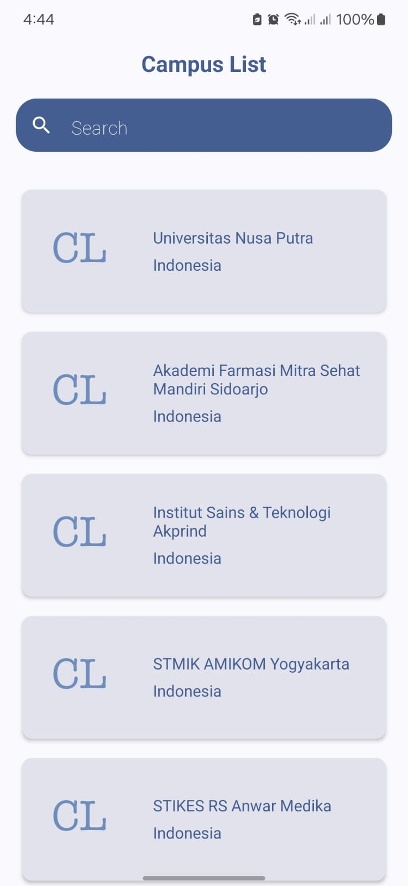
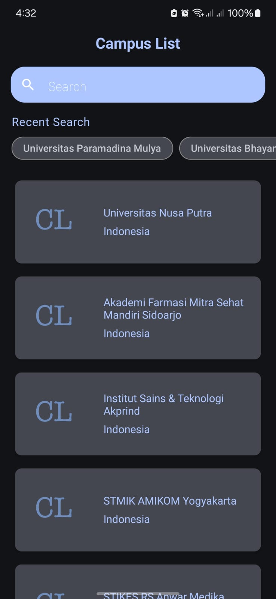

# Campus List: Exploring Indonesian Universities

**Campus List** is a modern Android application built with Kotlin, designed to help you explore universities across Indonesia. With a clean and intuitive interface, you can easily browse university details, search for specific institutions, and even visit their websites directly within the app.

**Objective**
This project aims to showcase best practices in Android development by enhancing a simple university list application with various functionalities. It demonstrates the use of modern libraries and tools to create a robust and user-friendly experience.

<div style="display: flex; justify-content: space-around;">
  
  
</div>

## Features

*   **Modern UI:** Built with Jetpack Compose for a smooth and visually appealing user experience.
*   **Offline Access:** University data is stored locally using Room or DataStore, enabling access even without an internet connection.
*   **Powerful Search:** Quickly find universities by name using the integrated search functionality.
*   **In-App Browsing:** Open university websites directly within the app using an embedded browser.
*   **Robust Testing:** Comprehensive unit tests ensure the app's stability and reliability.

## Technologies

*   **Language:** Kotlin
*   **Architecture:** MVVM/MVI
*   **UI:** Jetpack Compose
*   **Dependency Injection:** Hilt
*   **Local Persistence:** Room or DataStore
*   **Coroutines & Flow:** Kotlin Coroutines & Flow

## API
The app uses the University Domains List API by Hipo Labs:

*   **API Endpoint:** [http://universities.hipolabs.com/search?country=indonesia](http://universities.hipolabs.com/search?country=indonesia)
*   **API Documentation:** [https://github.com/Hipo/university-domains-list-api](https://github.com/Hipo/university-domains-list-api)

## Installation

**Prerequisites:**

*   Android Studio (latest stable version): [Download Android Studio](https://developer.android.com/studio)
*   Basic knowledge of Kotlin and Android development

**Steps:**

1.  **Clone the repository:**

    ```bash
    git clone https://github.com/byansanur/campus-list.git
    ```

2.  **Open the project:**

    Open the cloned `campus-list` directory in Android Studio.

3.  **Sync with Gradle:**

    Click "File" -> "Sync Project with Gradle Files" to download project dependencies.

4.  **Run the app:**

    Click the "Run" button and select a connected device or emulator.
